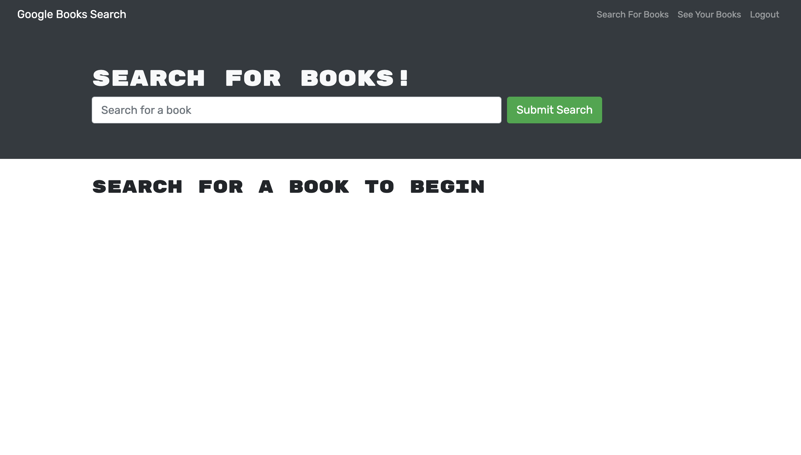
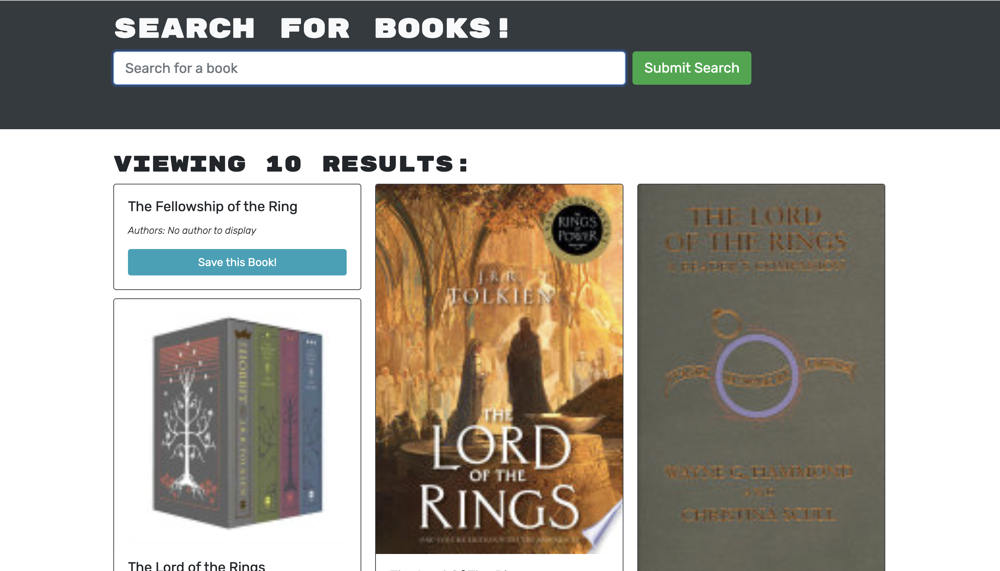
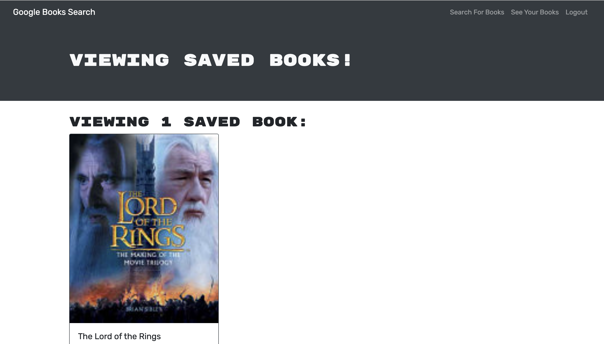

  # Book Worm
  ## Description
  A MERN Stack application that allows a user to search the books they want and save them. It keeps the saved books saved to their login for future reference.
  ## Deployed Page

  ## Screenshot

  ## Table of Contents
- [Book Worm](#book-worm)
  - [Description](#description)
  - [Deployed Page](#deployed-page)
  - [Screenshot](#screenshot)
  - [Table of Contents](#table-of-contents)
  - [Questions](#questions)
  
You can copy, modify, distribute and perform the work, even for commercial purposes, all without asking permission. See Other Information below.  
  
  ## Questions  
  If you have any further questions you may contact me at:  
  GitHub: [My GitHub](https://github.com/RichardBaier)  
  Email: bearbaier@gmail.com